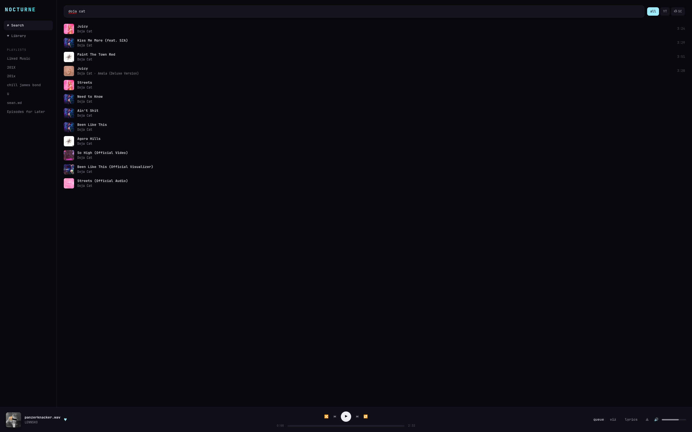

# NOCTURNE — desktop

A windowed (Electron) copy of the terminal [NOCTURNE](https://github.com/jprouhana/nocturne).
The GUI is a thin front-end; all the real work — YouTube Music auth, `mpv`
playback, `yt-dlp`, SoundCloud merge, synced lyrics, AI force-alignment — is the
**same `ytm.py` core** running as a local backend (`backend.py`).

```
┌── Electron (src/) ──┐   HTTP    ┌── backend.py ──┐   imports
│  search · player ·  │ ───────►  │  localhost JSON │ ────────►  ytm.py core
│  lyrics · viz · …   │ ◄───────  │  API on :8770   │            (mpv, ytmusicapi,
└─────────────────────┘   poll    └─────────────────┘             yt-dlp, lyrics…)
```



## Features
- **Search** (YouTube Music + SoundCloud `☁` merged) · **Library** · **Playlists**
- Play / pause / skip / **seek** / **volume** · **shuffle** · **repeat** (off/all/one)
- **Like / unlike** (♥, syncs to your YT Music account)
- **Queue** panel (up-next, click to jump) · hover **＋** to enqueue
- **Synced lyrics** + a big now-playing view · **⟁ AI-align** lyrics to the exact audio
- **Visualizer** — live FFT bars off the system audio
- **7 themes** (`c` cycles) · remembers window size + volume

## Keys
`space` play/pause · `shift+←/→` prev/next · `L` lyrics · `q` queue · `v` viz ·
`c` theme · `r` repeat · `s` shuffle · `Y` like · double-click a track to play

## Install
You need the terminal NOCTURNE's **core** (for `ytm.py` + its Python deps + your
sign-in), **Node 18+**, and **mpv**. Pick your platform:

| OS | guide |
|----|-------|
| **Linux** | below |
| **Windows** | [docs/INSTALL-WINDOWS.md](docs/INSTALL-WINDOWS.md) |
| **macOS** | [docs/INSTALL-MACOS.md](docs/INSTALL-MACOS.md) |

### Linux quick start
```sh
# 1. the core (if you don't already run terminal NOCTURNE)
git clone https://github.com/jprouhana/nocturne ~/ytm-tui
cd ~/ytm-tui && ./install.sh          # makes the .venv, walks you through sign-in

# 2. the desktop app
git clone https://github.com/jprouhana/nocturne-desktop ~/nocturne-desktop
cd ~/nocturne-desktop && npm install
npm start
```
It auto-finds `~/ytm-tui/.venv` and reuses the terminal app's sign-in. No
separate login. The backend is spawned and killed with the window.

## Config (env overrides)
- `NOCTURNE_YTM` — path to `ytm.py` (default `~/ytm-tui/ytm.py`)
- `NOCTURNE_PY`  — Python interpreter to run the backend (default: the ytm-tui venv)
- `NOCTURNE_PORT` — backend port (default `8770`)

## Layout
- `main.js` — Electron shell; spawns/kills the Python backend, remembers window bounds
- `backend.py` — imports `ytm.py`, serves the localhost JSON API
- `src/` — the GUI (`index.html` / `style.css` / `renderer.js`)
- `ROADMAP.md` — build log

## Notes
- **`⟁ AI-align`** reuses a local faster-whisper install and a bash helper
  (`nocturne-align`); it's **Linux/macOS only** and benefits from a GPU. Without
  it, everything else still works — only that one button is a no-op.
- The **visualizer** taps the system audio monitor. Linux uses PipeWire/PulseAudio
  out of the box; macOS needs a loopback device (see the macOS guide).
